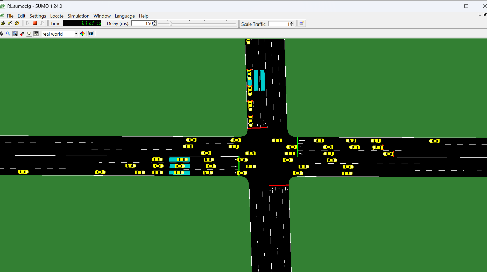
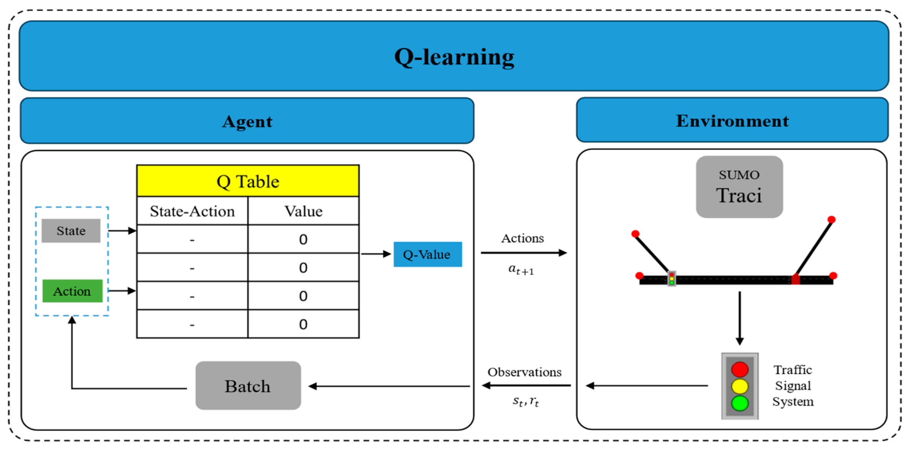
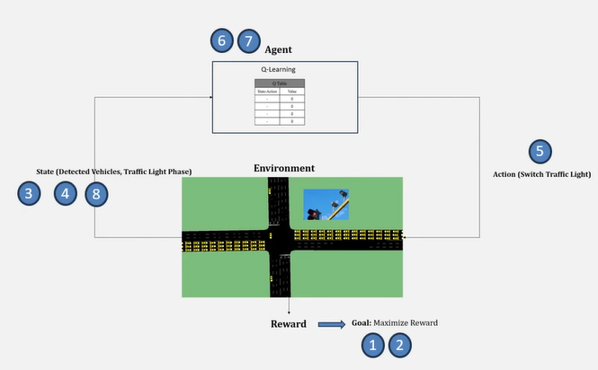
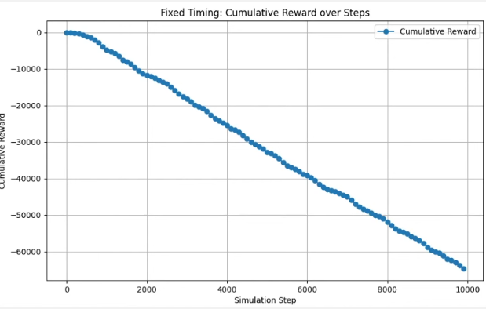
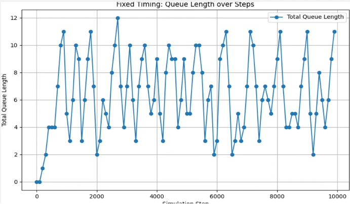
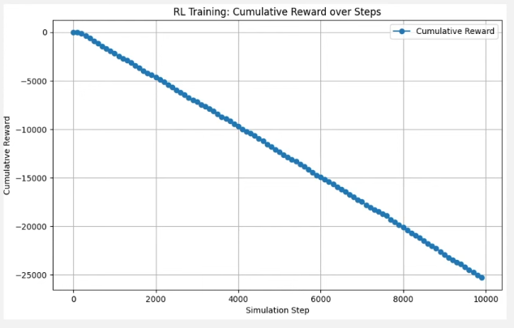
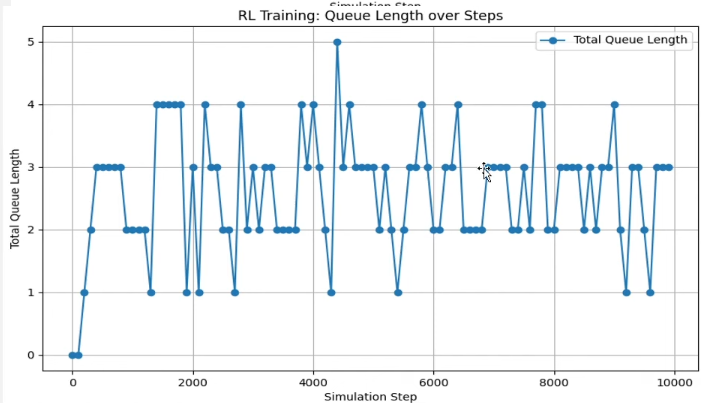

# Reinforcement Learning for Traffic Signal Control in SUMO

This project compares reinforcement-learning based traffic signal control strategies in a SUMO road-network simulation. The traffic light controller observes queue lengths from lane-area detectors, chooses whether to keep or switch the current phase, and learns a policy that reduces total vehicle queue length over time.

## Project Highlights

- SUMO network, route, detector, and simulation configuration files are included.
- Tabular Q-learning controller for online traffic signal optimization.
- Deep Q-learning controller using TensorFlow/Keras.
- Fixed-time baseline script for comparison against RL-based control.
- Training plots for cumulative reward and total queue length.

## Repository Structure

```text
.
|-- README.md
|-- requirements.txt
|-- docs/
|   |-- images/
|   |   |-- fixed-timing-cumulative-reward.png
|   |   |-- fixed-timing-queue-length.png
|   |   |-- q-learning-architecture.png
|   |   |-- rl-control-loop.png
|   |   |-- rl-training-cumulative-reward.png
|   |   |-- rl-training-queue-length.png
|   |   `-- sumo-simulation.png
|   `-- minor_proj_ppt.pptx
|-- src/
|   |-- baseline/
|   |   `-- traciFT.py
|   |-- deep_q_learning/
|   |   `-- traciDQL.py
|   `-- q_learning/
|       `-- traciQL.py
`-- sumo/
    |-- RL.add.xml
    |-- RL.net.xml
    |-- RL.netecfg
    |-- RL.rou.xml
    `-- RL.sumocfg
```

## Requirements

- Python 3.9+
- Eclipse SUMO 1.24.0 or compatible
- SUMO environment variable configured:

```powershell
$env:SUMO_HOME = "C:\Program Files (x86)\Eclipse\Sumo"
```

Install Python dependencies:

```bash
pip install -r requirements.txt
```

TensorFlow is only required for the Deep Q-learning script. If you only want to run fixed-time or tabular Q-learning experiments, NumPy and Matplotlib are enough.

## How to Run

Run commands from the repository root.

### Fixed-Time Baseline

```bash
python src/baseline/traciFT.py
```

This runs the SUMO simulation with the default fixed traffic light program and records reward and queue-length history.

### Tabular Q-Learning

```bash
python src/q_learning/traciQL.py
```

This starts SUMO GUI and trains a tabular Q-learning controller online using:

- State: queue lengths from six lane-area detectors plus current signal phase.
- Actions: keep current phase or switch to the next phase.
- Reward: negative total queue length.
- Stability constraint: minimum green time before switching.

### Deep Q-Learning

```bash
python src/deep_q_learning/traciDQL.py
```

This uses a small neural network to approximate Q-values instead of storing them in a dictionary. The script runs SUMO in CLI mode by default for better stability.

## SUMO Scenario

The simulation files are stored in `sumo/`.

- `RL.net.xml`: road network and traffic light definitions.
- `RL.rou.xml`: traffic flows.
- `RL.add.xml`: lane-area detectors used for queue measurement.
- `RL.sumocfg`: main SUMO configuration file.
- `RL.netecfg`: NetEdit configuration for editing the scenario.

The main controlled traffic light id is `Nod`, as defined in `RL.net.xml`.

## Simulation Preview



## Learning Setup

The RL scripts use a simple traffic-control formulation:

- Queue length is read from SUMO lane-area detectors through TraCI.
- The current traffic signal phase is included in the state.
- The agent receives higher reward when queues are shorter.
- Phase switching is constrained by a minimum green interval to avoid unstable signal behavior.

### Control Flow





## Output

During simulation, the scripts print state, action, reward, cumulative reward, and learned Q-values. At the end, Matplotlib plots:

- Cumulative reward over simulation steps.
- Total queue length over simulation steps.

SUMO detector output files such as `e2_*.xml` are generated during runs and are intentionally ignored by Git.

## Result Snapshots

### Fixed-Time Baseline





### RL Training





## Notes

- Use `sumo-gui` in the Q-learning and fixed-time scripts when you want to watch the simulation.
- Use `sumo` for longer experiments when GUI rendering is not needed.
- If SUMO cannot start, verify that `SUMO_HOME` is set and that SUMO's `tools` folder is available.
